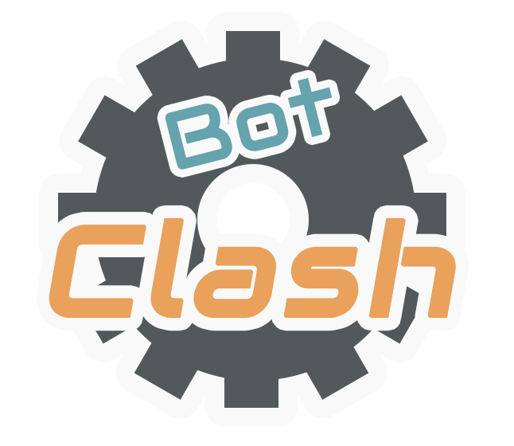
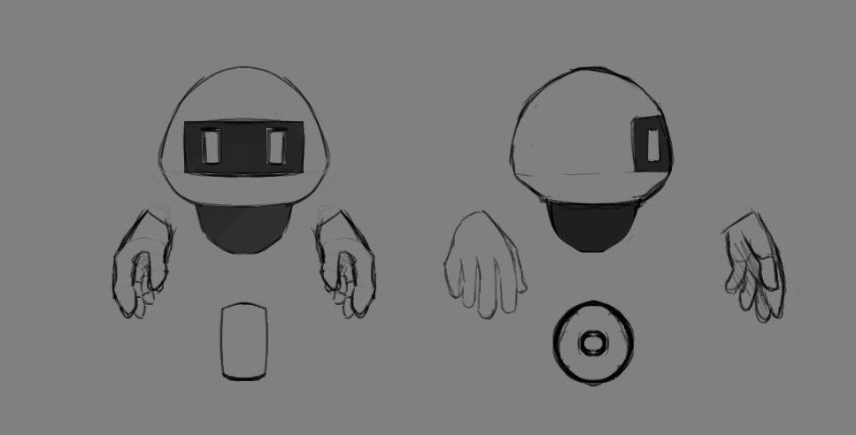

__Estructura GDD :__ 
 

  

* Twitter: https://twitter.com/Boops_Games
* Instagram: https://www.instagram.com/boopsgamesstudio/
* Itch.io: https://itch.io/profile/boops-games-studio
* Youtube:https://www.youtube.com/channel/UCdlggk1-f6dqdhcsiB29jWA

___

(Intrucciones)

___

# 1.- Índice

+ __[2.- Introducción](#intro)__
	+ __[2.1 Concepto del juego](#game_concept)__
	+ __[2.2 Características principales](#main_features)__
	+ __[2.3 Género](#genre)__
	+ __[2.4 Propósito y público objetivo](#target)__
	+ __[2.5 Jugabilidad (idea básica)](#basic_gameplay)__
	+ __[2.6 Estilo visual](#visual_style)__
	+ __[2.7 Alcance](#reach)__
	
+ __[3.- Mecánicas de juego](#mechanics)__
	+ __[3.1 Jugabilidad (en profundidad)](#gameplay)__
	+ __[3.2 Flujo de juego](#game_flow)__
	+ __[3.3 Personajes](#characters)__
	+ __[3.4 Movimiento](#movement)__
	+ __[3.5 Cómo jugar](#controls)__
	
+ __[4.- Interfaz](#interface)__

+ __[5. Arte](#art)__

+ __[6. Sistema de monetización](#money)__

+ __[7. El futuro del proyecto](#future)__

+ __[8. Historial de versiones](#changelog)__

+ __[9. Boops Games Studio](#credits)__

# 2.- Introducción

Este es el documento de diseño de **Bot Clash**, un videojuego de navegador desarrolado por _Boops Games Studio_.
	
+ ##  2.1 Concepto del juego	

Juego multijugador de robots que exploran un escenario en busca de mejoras y armas para luego luchar e intentar ser el último superviviente 

+ ## 2.2 Características principales		
	
**Fase de exploración**: Se investiga un mundo lleno de mejoras y armas. Hacerse con las más valiosas te ayudará a alcanzar la victoria.

**Gran variedad de armas y personajes**: 4 personajes a elegir y 12 tipos de armas para luchar (¡Si las encuentras!)

**Batalla**: Tras explorar, toca darse mamporros... Con todo lo recolectado, tira del escenario a tus rivales antes de que te tiren a ti y proclámate vencedor.
	
+ ## 2.3 Género	
	
Juego multijugador con toques de exploración y battle royale
	
+ ## 2.4 Propósito y público objetivo
	
El juego se puede jugar de forma casual, tiene un elemento de aletoriedad en los objetos que puede hacer que cualquier persona gane. Pero también de forma competitiva, ya que saberse los mapas de exploración de memoria ayuda a conseguir los mejores objetos.
La idea es buscar un equilibrio entre los dos públicos.
Por lo general, se espera un público joven.

+ ## 2.5 Jugabilidad(idea básica)
	
**Exploración**: Se explora el escenario y se cogen mejoras y armas.

**Batalla**: Con lo recogido en la anterior fase, se lucha por ser el último robot en matenerse en una plataforma sin caerse, pudiendo tirar a tus rivales con tus armas.
	
+ ## 2.6 Estilo visual	
	
Se ha optado por usar voxel art en isométrico, dándole un estilo particular y fácil de moldear.

+ ## 2.7 Alcance
	
Con nuestro equipo, planeamos tener las mecánicas base del juego, 4 personajes, 1 escenario y 12 tipos de armas.

# 3.- Mecánicas de juego

+ ## 3.1 Jugabilidad (en profundidad)	
	
Es un juego multijugador para 4 personas. 
Se explora un escenario isométrico en busca de mejoras y armas. Los jugadores podrán verse y chocarse entre ellos, pero no podrán atacarse en el mapa de exploración. Los objetos que se cojan dejarán de estar disponibles para el resto de jugadores.
En el escenario, habrá distintas *burbujas* de colores para los stats y armas.

**Stats**

Los stats permitirán aumentar las habilidades del robot del jugador.
Los stats vendrán en burbujas de tres tamaños: pequeñas (1 ud), medianas (2 uds) y grandes (4uds). Además, vendrán en tres colores: Rojo (Ataque), Azul (Defensa) y Amarillo (Velocidad). Cuanto más grande sea su tamaño, más difícil será obtenerlas.

Los tipos de stats son:

+ **Ataque**: Permite romper defensas y tirar más lejos a los jugadores.

+ **Defensa**: Cuanto más tengas, más golpes podrás recibir sin moverte mucho.

+ **Velocidad**: Cómo de rápido se moverá el personaje y cómo de rápido serán los ataques.

Un robot podrá recoger como máximo 10 unidades de cada tipo de stat.
A su vez, dependiendo de la clase de personaje elegido, el robot tendrá unos stats base que aumentan el máximo base(pudiendo llegar a ser más de 10).
Por último, a los stats del robot, se le suma los del arma que coja.

**Cadencia**

Se trata de un stat exclusivo de las armas, se refiere al tiempo que se tarda entre uso y uso. A mayor cadencia, menor es el tiempo entre ataques.

**Clases de armas**

+ **Cuerpo a cuerpo**: Eficaz contra escudos porque al golpearlos paralizan al portador. Suelen tener alto ataque.

+ **Escudos**: Eficaz contra armas a distancia porque repelen el daño al recibir disparos de frente. Suelen tener alta defensa.

+ **Armas a distancia**: Eficaz contra armas cuerpo a cuerpo por poder atacar a distancia. Suelen tener alta cadencia.

Dentro de cada clase, habrá distintos tipos de arma según su rareza. La rareza se determina por el color de las armas.

Común: Azul
Rara: Violeta
Legendaria: Naranja

**Cuerpo a cuerpo**

+ **Común: Daga** At:+1 Df:+1 Vl:+4 Cd:+4

+ **Raro 1: Espada** At:+4 Df:+2 Vl:+3 Cd:+3

+ **Raro 2: Hacha** At:+5 Df:+4 Vl:+2 Cd:+1

+ **Legendario: Lanza**  At:+3 Df:+4 Vl:+3 Cd:+4

**Escudos**

+ **Común: Rodela** At:+2 Df:+2 Vl:+3 Cd:+3

+ **Raro 1: Escudo de lágrima** At:+4 Df:+5 Vl: +1 Cd:+2

+ **Raro 2: Mediano** At:+3 Df:+3 Vl:+3 Cd:+3

+ **Legendario: Escudo punzante**  At:+5 Df:+5 Vl:+2 Cd:+2

**Distancia**

+ **Común: Pistola plasma** At:+2 Df:+1 Vl:+3 Cd:+4

+ **Raro 1: Metralleta plasma** At:+1 Df:+2 Vl:+4 Cd: +5

+ **Raro 2: Escopeta plasma** At:+5 Df:+3 Vl:+3 Cd:+1

+ **Legendario: Cañón plasma**  At:+5 Df: +4 Vl:+2 Cd:+3

Tras la fase de exploración, que durará un tiempo a elegir, se accederá a la pantalla de resultados y se pedirá al jugador (Si juega en móvil) que gire su pantalla para la fase de batalla.

Los stats finales de cada robot son los siguientes
Stats base del personaje + Stats recogidos (max 10 por categoria) + Stats armas

En la fase de batalla el objetivo será tirar a los demás rivales del escenario. Se aplicarán las mejoras y se equipará el arma al jugador para este fin.

Un golpe tiene en cuenta el ataque del que lo da y la defensa del que lo recibe. 

El robot que quede en pie al finalizar, gana la partida.

+ ## 3.2 Flujo de juego	
	
Al principio del juego, se tendrá que buscar una sala y entrar
Se deberá escoger el personaje que se desee.

Se jugará la fase de exploración, y tras pasar un tiempo, se mostrarán los resultados de la fase de exploración y se pasará a la batalla.

Tras la batalla, se ven los resultados finales y se acaba la partida, volviendo al menú principal.

+ ## 3.3 Personajes	

A parte de su aspecto, los distintos personajes tienen características base, pudiendo tener más del máximo de stats de un tipo	
	
**Robot equilibrado**: at: 2 df: 2 vl: 2

  

**Robot ataque**: at: 3 df:1 vl:2

  

**Robot defensa**: at:2 df: 3 vl:1

  

**Robot velocidad**: at:1 df:2 vl:3

  

+ ## 3.4 Movimiento
	
En isométrico, al darle a la *W* el personaje acelerará y con *S* decelerará. Con *A* y *D* el personaje girará sobre su eje o girará mientras se mueve si se pulsa a su vez *W* o *S*.

+ ## 3.5 Cómo Jugar

Hay dos modos de jugar, uno más pensado para dispositivos móviles y otro más pensado para PC

***Controles:***

* **Jugando en dispositivo móvil**: Joystick virtual y dos botones virtuales.

* **Jugando en PC**: *WASD* para moverse, *O* para la acción 1 y *P* para la acción 2

# 4.- Interfaz

+ ## 4.a Diagrama de flujo (Idea inicial)	

  

+ ## 4.b Menú principal

  

La idea de *Tus reglas* se descartó posteriormente. Se añadió una sección de *Contacto*.

+ ## 4.c Cómo jugar

  

  

  

  
  
  

+ ## 4.d Opciones	

 

+ ## 4.e Selección de personaje	

+ ## 4.f Juego	

+ ## 4.g Pantalla de transición

+ ## 4.h Resultados

# 5.- Arte 

  

  

  

# 6.- Sistema de monetización

Season Pass (Con Cebo y Anzuelo)

La idea es ofrecer el juego base de forma gratuita, pero cobrar por nuevo contenido.
De esta forma, el jugador puede jugar gratis, pero si quiere experimentar todo el contenido que le puede ofrecer el juego, debe pagar un extra.
La idea del season pass es poder financiar el proyecto mientras se desarrolla, el jugador se beneficia porque el contenido adicional le sale más barato de esta forma. Se ofrecería un pack con mapas, personajes, armas, mecánicas, etc.

# 7.- El futuro del proyecto

# 8.- Historial de versiones

+ (07/11/2019) Estructura básica del documento.
+ (12/11/2019) Añadida información inical del juego
+ (13/11/2019) Detallada información sobre la jugabilidad y la monetización
+ (06/12/2019) Añadido concept y corregido detalles

# 9.- Boops Games Studio

  

+ Alejandro Hernández Pérez -
+ Mario Marquez Balduque - 
+ Diego Sagredo de Miguel - 
+ Gabriel Muñoz Borchers - 
+ Carlos Ventura Padina González - 
